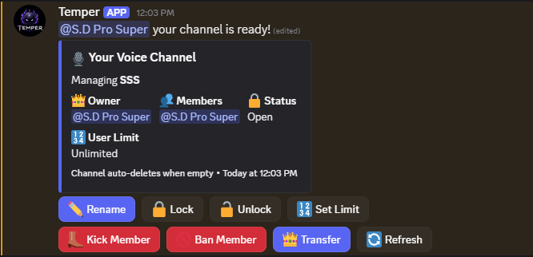

# Temper bot

Temper is a versatile Discord bot designed to enhance voice communication within your server. Its primary function is to create private voice channels (VCs) for exclusive conversations among members. What sets Temper apart is the level of control it grants to users within these private VCs. Members with access to a private VC gain the ability to manage it effectively, with options to kick or ban users from the channel, rename the VC to suit their needs, and access a range of additional moderation and customization features. This empowers users to tailor their private communication spaces to their specific preferences and requirements, fostering a more engaging and personalized Discord experience.

## Owner

- GitHub: [SD-pro-cool](https://github.com/SD-pro-cool)

## Highlights

- Discord bot with moderation, utility, music, fun, and management systems
- Zenith dashboard for guild configuration and live status views
- Shared config between bot commands and dashboard controls
- AutoMod, Anti-Nuke, logs, command center, docs, and music monitoring
- MongoDB-backed data storage
- Lavalink-based music system

## Showcase




## Project Structure

- `build.mjs` It builds the project accourding to the structure and source.
- `.env` it contains the the token of your bot and is mendatary to fill.
- `src/` it contains the main body of your bot and is a very major part.
- `attach/` contains the picture of the bot to showcase screenshots for GitHub.

## Tech Stack

- Node.js
- Discord.js
- Express / native Node HTTP


## Local Setup

1. Install dependencies:

```bash
npm install
```

2. Create your env file:

```bash
copy .env.example .env
```

3. Fill in your real values inside `.env`.

- values to be filled:

  - `DISCORD_BOT_TOKEN`
  - `TOKEN`

- values alredy filled:

  - `PORT`

4. Build everything:

```bash
npm run build
```

5. Start everything:

```bash
npm start
```


## Bot Hosting Setup

The bot should be deployed on a host that supports long-running Node processes.

Good choices:

- Pterodactyl
- Railway
- Render background service
- VPS
- PM2


## Security Note

This repository is configured to read sensitive values from environment variables. Do not commit your `.env` file.

If a token, client secret, database URI, or webhook was ever exposed before cleanup, rotate it before making the repository public.

## License

This project is distributed under the license in [LICENSE](LICENSE).
